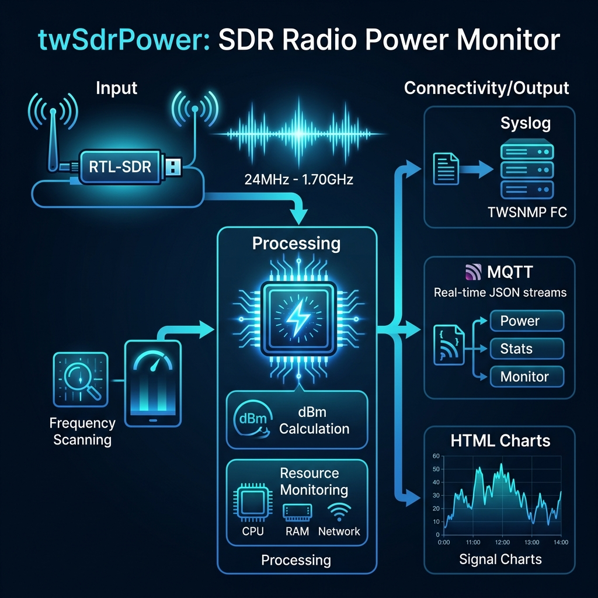

# twSdrPower
[English Version](README.md)

twSdrPowerは、RTL-SDRを活用して広範囲（24MHz〜1.7GHz）の無線周波数（RF）電力を監視する軽量なセンサーアプリケーションです。MQTTとSyslogを介してデータをストリーミングすることで、スペクトラム使用状況のリアルタイムな可視化を可能にし、電磁ノイズ調査やネットワーク統合型のRF監視に最適なツールとなります。

[](https://pkg.go.dev/github.com/twsnmp/twSdrPower)
[](https://goreportcard.com/report/twsnmp/twSdrPower)



## 概要

RTL-SDRを利用して周辺の電波の強度（電力）をモニタし、その情報をTWSNMP FCなどの管理システムへSyslogまたはMQTTで送信するためのセンサープログラムです。電磁波のノイズ調査や、特定の周波数帯の利用状況の可視化に役立ちます。

### 主な機能

- **周波数別電力モニタリング**: 指定した範囲（24MHz - 1.7GHz）をスキャンし、各周波数の信号強度（dBm）を算出します。
- **マルチプロトコル送信**: 収集したデータをSyslog（RFC5424形式）またはMQTT（JSON形式）でリアルタイムに送信可能です。
- **リソース監視**: センサーが動作しているデバイスのCPU、メモリ、ネットワーク使用量も併せて監視し、統計情報として送信します。
- **ビジュアル分析**: スキャン結果をグラフ化し、HTML形式のチャートとして自動出力する機能を備えています。ダークモードにも対応しています。

### 取得データ詳細

現在のバージョンでは以下の情報を取得・送信できます。

- **電波強度データ (Power)**: 指定範囲(デフォルト24MHz - 1.67GHz)の各周波数(デフォルト1MHz単位)ごとの電波の強度情報。
- **リソースモニタ (Monitor)**: センサー本体のリソース（CPU使用率, メモリ使用量, ネットワーク送受信）。
- **統計情報 (Stats)**: スキャン回数、総データ数、送信成功数などの稼働統計。

取得した電波強度をグラフ（HTML形式）として出力することもできます。

## ステータス

v2.0.0 MQTT送信機能の追加、ビルド環境の改善

## ビルド
### 環境
ビルドするためには、以下が必要です。

- Go 1.25以上
- librtlsdr
- Docker (Linux版のビルドに必要)
- make

RTL-SDRのライブラリはMac OSの場合、Homebrewでインストールできます。
```bash
brew install librtlsdr
```
Linux版は、Docker環境の中でビルドするので、ホスト環境にはmakeとDockerがあればビルドできます。

### ビルド方法
ビルドはmakeで行います。
```bash
$ make
```
以下のターゲットが指定できます。
```
  all        全実行ファイルのビルド（Mac, Linux amd64/arm/arm64）
  mac        Mac用の実行ファイルのビルド
  clean      ビルドした実行ファイルおよびdistディレクトリの削除
  zip        リリース用のZIPファイルを作成
```

ビルドされた実行ファイルは `dist` ディレクトリに作成されます。

## 実行方法

### 環境
実行するためには、RTL-SDRのライブラリが必要です。
Mac OSの場合は、開発環境の説明にあるbrewでインストールできます。
Linux環境にはrtl-sdrパッケージをインストールしてください。

```bash
$ sudo apt install rtl-sdr
```

### 使用法

```
Usage of twSdrPower:
  -chart string
    	chart title
  -dark
    	dark mode chart
  -debug
    	Debug mode
  -end string
    	end frequency (default "1667M")
  -folder string
    	chart folder (default "./")
  -gain int
    	RTL-SDR Tuner gain (0=auto)
  -interval int
    	syslog/MQTT send interval(sec) (default 600)
  -list
    	List RTL-STR
  -mqtt string
    	MQTT broker destination (e.g., 192.168.1.1:1883)
  -mqttClientID string
    	MQTT client ID (default "twSdrPower")
  -mqttPassword string
    	MQTT password
  -mqttTopic string
    	MQTT topic (default "twsnmp/twSdrPower")
  -mqttUser string
    	MQTT user
  -once
    	Only once
  -sdr int
    	RTL-SDR Device Number
  -start string
    	start frequency (default "24M")
  -step string
    	step frequency (default "1M")
  -syslog string
    	syslog destination list (comma separated)
```

#### syslog送信先の設定
syslogの送信先はカンマ区切りで複数指定できます。ポート番号を指定することも可能です。
```bash
-syslog 192.168.1.1,192.168.1.2:5514
```

#### MQTT送信の設定
MQTTブローカーの情報を指定します。
```bash
-mqtt 192.168.1.1:1883 -mqttTopic my/topic
```
MQTTで送信されるデータはJSON形式です。以下のトピックに送信されます。
- `{topic}/Power`: 電波強度データ
- `{topic}/Stats`: 統計データ
- `{topic}/Monitor`: リソースモニタデータ

#### 起動例 (Mac OSの場合)
```bash
./dist/twSdrPower.darwin -chart noise -gain 500 -dark -folder /tmp -interval 300 -sdr 0 -mqtt 192.168.1.250:1883
```

### デバイスの確認
`-list` オプションを付けて起動することで、接続されているRTL-SDRデバイスを確認できます。
```bash
$ ./dist/twSdrPower.darwin -list
Device List count=1
0,Generic RTL2832U OEM,Realtek,RTL2838UHIDIR,00000001
```
先頭の `0` がデバイス番号（`-sdr` オプションで指定する値）です。

## 著作権

./LICENSE を参照してください。

```
Copyright 2022-2026 Masayuki Yamai
```
